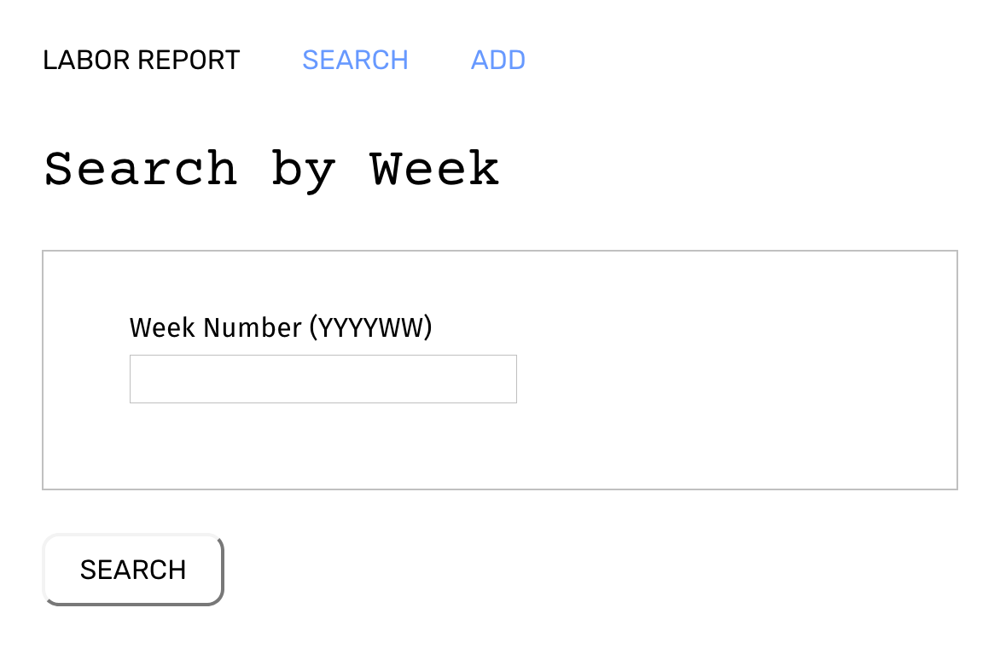

# node-capstone
Node Capstone project for Thinkful curriculum

## Weekly Sales & Labor Report for a Bakery

This app allows the user to input weekly sales and labor data manually from siloed business systems to output a weekly report on total sales, total labor as a percent of sales, and labor by department as a percent of sales. It uses D3.js to draw the report. To search for a report, the user can enter the week number as a 4-digit year and 2-digit week number. To enter data for a new week, the user can select Add from the menu and then Add Labor Data and Add Sales Data.

The database currently contains sample data for weeks 201610 through 201620 for the purpose of testing and demonstration.

<a href="https://fast-citadel-48845.herokuapp.com" target="_blank">Click here for Live App</a>

<a href="https://documenter.getpostman.com/view/4144574/RzZ3LhFN" target="_blank">Click here for API Docs</a>

Technology Used:

 - HTML/CSS
 - Javascript/JQuery
 - MongoDB
 - Express/Node
 - D3.js

