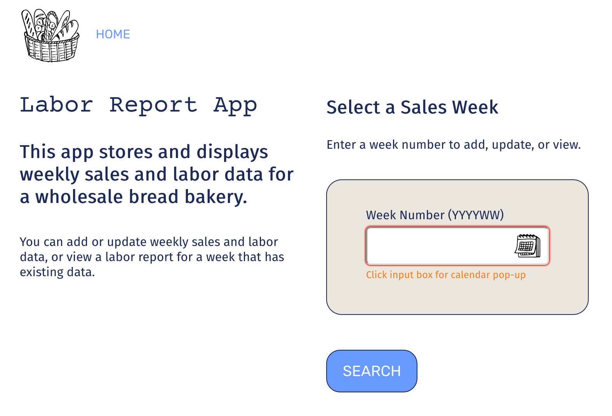

# node-capstone
Node Capstone project for Thinkful curriculum

## Weekly Sales & Labor Report for a Bakery

This app allows the user to input weekly sales and labor data manually from siloed business systems to output a weekly report on total sales, total labor as a percent of sales, and labor by department as a percent of sales. It uses D3.js to draw the report. To begin, the user can enter the desired week number as a 4-digit year and 2-digit week number. A calendar week-picker pop-up will assist the user to select a week. Alternatively, the user can simply type in the correctly formatted week number (YYYYWW) into the input box without using the calendar picker. After clicking "Search", the user will be taken to the search results page. If existing data is found in the database for the searched week, the search results page will display the labor report--the labor costs of 5 departments as a percentage of total sales. The search results page also provides buttons linking to form pages to update the data (if it exists) or to add data (if data for the searched week was not found). 

The database currently contains sample data for weeks 201610 through 201620 for the purpose of testing and demonstration.

Live app: <https://fast-citadel-48845.herokuapp.com>

API docs: <https://documenter.getpostman.com/view/4144574/RzZ3LhFN>

Technology Used:

 - HTML/CSS
 - Javascript/JQuery
 - MongoDB/Mongoose
 - Express/Node
 - D3.js

